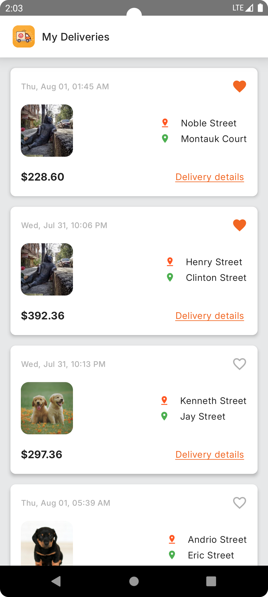
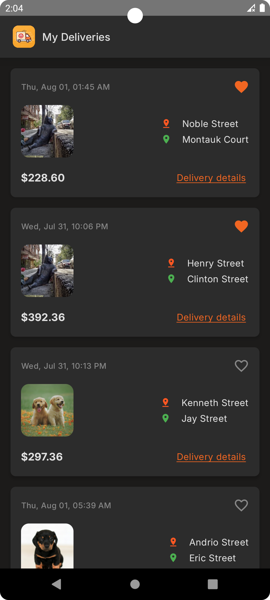
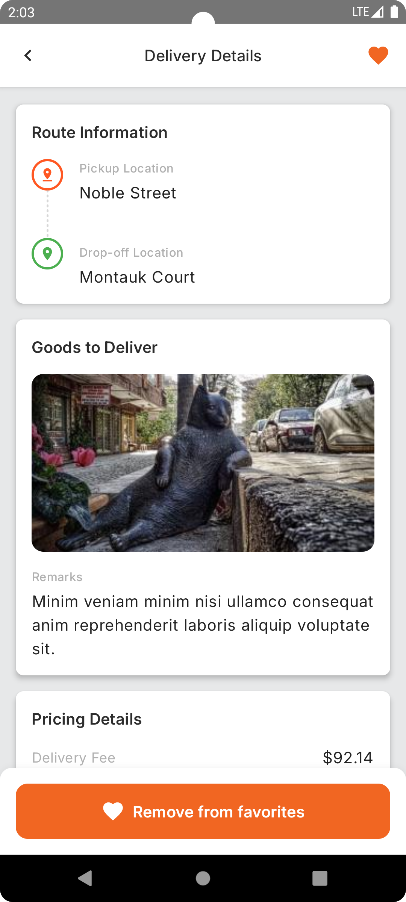
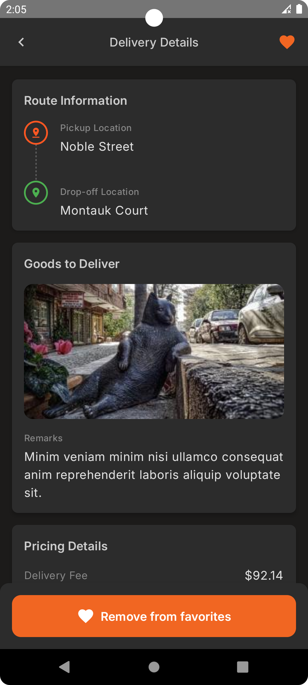
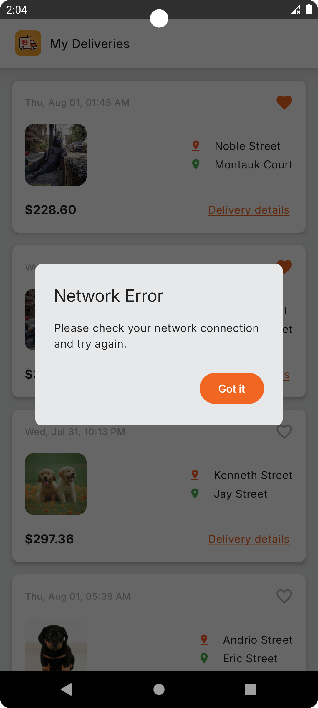
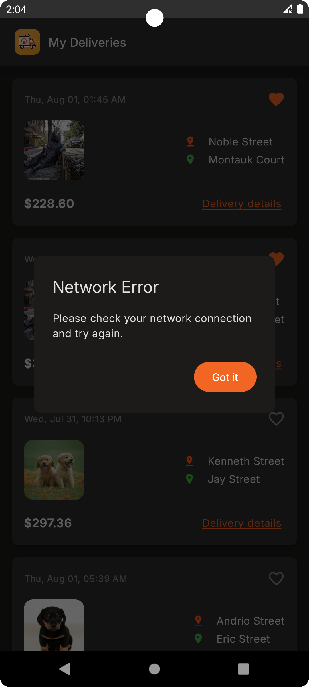

# My Deliveries

A modern Android delivery tracking application built with Jetpack Compose and following Clean Architecture principles. The app provides a seamless experience for tracking deliveries with features like real-time updates, offline support, and a beautiful Material 3 design.

## 📱 Screenshots

<div align="center">
<table>
  <tr>
    <td></td>
    <td></td>
  </tr>
  <tr>
    <td>Delivery List (Light)</td>
    <td>Delivery List (Dark)</td>
  </tr>
</table>

<table>
  <tr>
    <td></td>
    <td></td>
  </tr>
  <tr>
    <td>Delivery Details (Light)</td>
    <td>Delivery Details (Dark)</td>
  </tr>
</table>

<table>
  <tr>
    <td></td>
    <td></td>
  </tr>
  <tr>
    <td>Error Handling (Light)</td>
    <td>Error Handling (Dark)</td>
  </tr>
</table>
</div>

## ✨ Features

- **Modern UI/UX**: Built with Material 3 design principles and Jetpack Compose
- **Clean Architecture**: Follows MVVM pattern with Clean Architecture principles
- **Offline Support**: Local caching using Room database
- **Responsive Design**: Supports different screen sizes and orientations
- **Dark/Light Theme**: Dynamic theming with Material You support
- **Error Handling**: Comprehensive error handling with user-friendly messages
- **Pagination**: Efficient loading of large delivery lists
- **Favorite System**: Mark deliveries as favorites with persistent storage
- **Network State**: Handles various network states gracefully
- **Unit Testing**: Comprehensive test coverage for business logic
- **UI Testing**: Automated UI tests using Compose testing framework

## 🏗 Architecture

The application follows Clean Architecture principles with a clear separation of concerns:

```
app/
├── data/           # Data layer with repositories and data sources
│   ├── api/        # Remote API interfaces and models
│   ├── db/         # Local database using Room
│   ├── mapper/     # Data mapping between layers
│   └── repository/ # Repository implementations
├── domain/         # Business logic and domain models
│   ├── model/      # Domain entities
│   ├── repository/ # Repository interfaces
│   └── usecase/    # Use cases for business operations
└── presentation/   # UI layer with screens and viewmodels
    ├── components/ # Reusable UI components
    ├── navigation/ # Navigation handling
    └── screens/    # Individual screen implementations
```

## 🛠 Technologies & Libraries

### Android Development
- **Kotlin**: Primary programming language
- **Jetpack Compose**: Modern UI toolkit
- **Material 3**: Design system
- **Coroutines & Flow**: Asynchronous programming
- **Navigation Compose**: In-app navigation

### Architecture Components
- **ViewModel**: UI state management
- **Room**: Local database
- **Hilt**: Dependency injection

### Networking & Data
- **Retrofit**: HTTP client
- **OkHttp**: Networking
- **Gson**: JSON parsing
- **Coil**: Image loading

### Testing
- **JUnit**: Unit testing
- **Mockito**: Mocking framework
- **MockK**: Kotlin mocking
- **Turbine**: Flow testing
- **Compose Testing**: UI testing
- **Hilt Testing**: DI testing

## 🚀 Getting Started

### Prerequisites
- Android Studio Hedgehog | 2023.1.1 or newer
- JDK 17
- Android SDK 34
- Gradle 8.10

### Building the App
1. Clone the repository
2. Open the project in Android Studio
3. Run `./gradlew build` to build the project
4. Run the app on an emulator or physical device

## 🧪 Testing

The project includes both unit tests and instrumentation tests:

### Unit Tests
```bash
./gradlew test
```

### Instrumentation Tests
```bash
./gradlew connectedAndroidTest
```

## 🎯 Production Readiness

The application is built with production readiness in mind:

- **Code Quality**: Follows clean code principles with proper documentation
- **Error Handling**: Comprehensive error handling throughout the app
- **Performance**: Optimized image loading and caching
- **Testing**: Extensive test coverage
- **Maintainability**: Clear architecture and code structure
- **Scalability**: Modular design for easy feature additions
- **Security**: Proper handling of sensitive data
- **Accessibility**: Support for different screen sizes and orientations

## 📱 Device Support

- Minimum SDK: Android 11 (API 30)
- Target SDK: Android 14 (API 34)
- Supports both phones and tablets
- Handles different screen sizes and orientations
- Supports both light and dark themes

## 🤝 Contributing

Feel free to open issues and pull requests for any improvements you want to add.

## 📄 License

This project is licensed under the MIT License - see the [LICENSE](LICENSE) file for details.